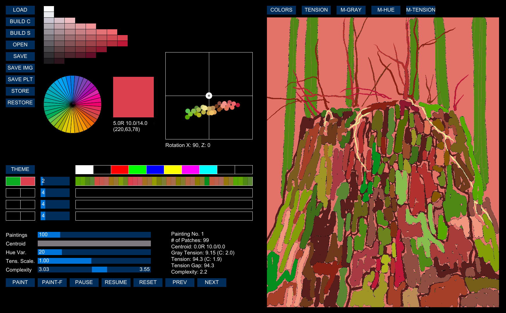

# ORStudio

Ordered Random Studio (ORStudio) is a program that I developed for my experimentation on color interactions. My typical painting process is that I first focus on narration and rhythm using lines and shapes in drawing. I then bring the drawing into ORStudio to experiment with various color sensations over the drawing. After the color study is done with ORStudio, I make the final archival painting, typically using oil on canvas.

Once a drawing is brought to ORStudio, I model it as a collection of color patches. Patches are identified by either contour or color in the drawing. As far as ORStudio is concerned, "painting" means applying colors to the color patches. ORStudio is for experimentation on color interactions and never meant to produce a final painting. Using computerized experimentation, ORStudio can save time and materials on the experimentation which would have cost too much, had it to be done with actual paints and canvases.

Note that ORStudio is to serve my own art process. Though some concepts in ORStudio may be common to artists, many are very unique to my own process and others might find them not applicable to their process. ORStudio generates thousands of "paintings" (i.e., applying colors into patches) within a few seconds. The generation process is guided by several design criteria. Color experimentation with ORStudio is mainly about designing such criteria. The design is a repetitive process until the artist finds a satisfied set of criteria. The criteria consist of the following four components:

* Master specification: The master specification is more about overall design of the painting in terms of color experience, without having any specific color in mind yet. Master specification includes design of tension, gray level and hue. Tension is the most important part of color experience. Unity in variety, or order in randomness is the ultimate experience to pursue in color design, and tension design is the single most effective tool to achieve it. Gray level and hue may be included in the master specification if needed. For instance, a gray level specification could be used to keep the narration that the source drawing might have. It is a similar approach that old masters had, which is glazing colors over a chiaroscuro drawing. Hue can also be specified if color choices need to be limited to a specific hue. For instance, patches for sky could be limited to blue.

* Color chords: Colors interact with each other when they are placed together. The interaction can be pleasing sometimes, ambiguous and puzzling other times. ORStudio introduces a simple yet powerful way to specify color interactions. It is the color chord system. A color chord is not defined as a set of individual colors, but instead specified as a transition path within the color sphere. The details of the color chord system are explained here. Once color chords are designed by the artist, ORStudio generates a palette of colors from the chords and applies them to the patches. The application process involves lots of mathematical computation and optimization to pick and choose the right colors to meet the criteria set by master specification and complexity control.

* Centroid: The tension in master specification is calculated relative to the centroid. The typical centroid would be the neutral gray. However, the centroid could be shifted to elsewhere as an artistic choice. Shifting the centroid out of neutral gray may create an ambient color mode because it will cause the painting process to pick up different colors based upon the tension calculated relative to the shifted centroid.

* Complexity control: Painting process with the same master specification, color chords and centroid can generate a wide variety of color combinations. Suppose there are 100 different colors that are applicable to any of 100 patches based on the given criteria. A painting could be with a different color for each patch, while another could be with only 10 different colors for all patches. They would yield similar experiences in terms of tensions, narration and color interactions. However, one would look busier than another. This is because they differ in complexity. ORStudio uses entropy to measure the complexity of a color combination in a painting. Higher entropy looks busier. The artist can control the range of complexity so that color combinations for the paintings are limited within the range.

ORStudio is written in Processing 4.3 with Java. No additional libraries need to be installed. 

Pyungchul Kim, 2024
http://orderedrandom.com
